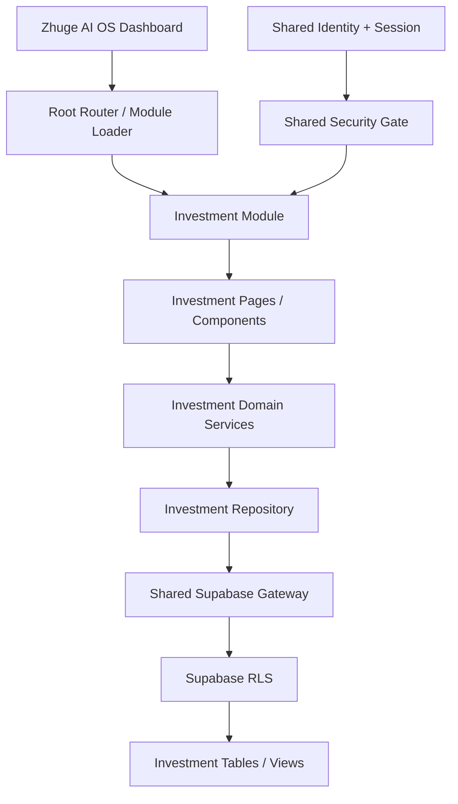

# Zhuge AI OS — Investment Integration Architecture Review

Document Version: 1.0
Phase: SIT Phase 1
Status: Approved — Gate 0 PASS
Coding Status: Not Authorized
PM Decision Date: 2026-08-01

Analysis Baseline:

- Repository: `zhuge-ai-os`
- Branch: `main`
- Git HEAD: `a757582e4e86aab81d6b2ee5166ba5a0ec3bcdaa`
- Migration Source: `investment-workspace-main.zip`（89 entries）
- Source SHA-256: `86765a8161110ba4184b2a592b41bab08b51b79b3854b2d5cbc847e323f534f3`

## 1. Executive Decision

Investment Workspace 應整併為 `modules/investment/`，但 Migration Source 不可整包複製。現有 ZIP 同時包含目前的 Identity Prototype（10.2.1）與舊版 UI Release（9.1.2），並且內含獨立 OAuth、LocalStorage Session、固定 `Workspace 001 / Jackal` 身分及直接 Supabase REST 呼叫。

正式整合採下列原則：

- Zhuge AI OS 負責 Identity、Session、Router、Theme、Supabase Transport 與 Security Gate。
- Investment 只保留投資領域模型、計算、查詢需求與畫面。
- 所有持久資料以 Supabase Auth UUID 為唯一使用者身分。
- 不保留舊、新兩套身份或資料存取流程。
- 本階段只完成分析、Repository Cleanup 與 Migration Plan，不修改 Production Runtime。

## 2. Source Review

### 2.1 Migration Source 現況

ZIP 內有兩個不同時期的實作：

| Source | 定位 | 處理方式 |
| --- | --- | --- |
| Root source（10.2.1） | Google Login、Legacy Claim、UUID Prototype | 不搬 OAuth／Session；保留身份遷移需求作為資料 Migration 參考 |
| `InvestmentWorkspace_Release_9.1.2_UICompact/` | 實際投資 Dashboard、持股、交易與 KPI UI | 作為 UI／Domain 行為參考，不整包搬入 |
| `packages/core/core.js` | 數字格式、投資組合彙總、損益分類 | 搬為 Investment Domain Service，補單元測試 |
| `packages/api/supabaseClient.js` | 查詢 app_users、portfolios、positions view、transactions、watchlists | 重新寫成 Module Repository，底層改用 Shared Supabase Gateway |
| `packages/ui/ui.js` | KPI、持股卡、交易與健康狀態 Render | 拆成 Pages／Components，不保留全域 `IW_UI` |
| `packages/ui/app.js` | DOM 綁定、登入、Legacy Link、Module Boot | 只保留 Module Boot 意圖；登入與 Legacy Link 全部移除 |
| `packages/auth/`、`packages/api/auth.js` | 第二套 OAuth 與 LocalStorage Session | 禁止搬移 |
| `packages/onboarding/` | LocalStorage Prototype | 本次不搬；未來須另案改為 Cloud-first Domain Flow |
| `apps/chrome/` | 獨立 Chrome Popup | 不納入 SIT Phase 1；未來只能使用 Shared Identity 與同一 API Contract |
| `database/.../migrations/` | 已執行標記或 No-op | 不足以重建 Schema，不可當正式 Migration |

### 2.2 已辨識的資料依賴

現有 Source 直接依賴：

- `app_users`
- `portfolios`
- `current_positions_view`
- `transactions`
- `watchlists`
- RPC `get_my_workspace_summary`
- RPC `claim_legacy_workspace`
- RPC `link_workspace_identity`

ZIP 未包含上述資料表、View、Function 與 RLS 的完整 DDL。因此 Coding 前必須先取得目前 Supabase Schema、Constraint、Index、Function、View 與 RLS Policy 清單。

### 2.3 可保留的 Domain Logic

- TWD／USD 資產彙總。
- 投入成本、市值、未實現損益與 ROI 計算。
- 台股／美股分類。
- 持股、交易流水與觀察清單的查詢意圖。
- 台灣投資顯示慣例：獲利紅、虧損綠。
- `Evidence → Reason → Decision` 產品原則。

### 2.4 不可搬移的 Platform Logic

- `signInWithGoogle()` 與任何第二次 OAuth。
- `iw_auth_session*` LocalStorage Session。
- Supabase URL／Anon Key 的 Investment 專用設定副本。
- `Workspace 001`、`Jackal`、`user_code` 作為 Runtime 身分。
- Investment 自己的 Router、Theme 或 Google Integration。
- 直接以 `fetch(.../rest/v1/...)` 管理 Token 的程式。

## 3. Migration Architecture



依賴方向固定為：

```text
app → modules/investment → shared → external services
```

禁止：

```text
modules/investment → modules/worklog
modules/investment → OAuth implementation
modules/investment → raw Supabase session storage
```

## 4. Target Folder Structure

```text
modules/investment/
├── index.html
├── pages/
│   ├── overview-page.js
│   ├── assets-page.js
│   ├── transactions-page.js
│   └── watchlist-page.js
├── components/
│   ├── portfolio-summary.js
│   ├── position-card.js
│   ├── transaction-list.js
│   └── watchlist-list.js
├── services/
│   ├── investment-module.js
│   ├── investment-repository.js
│   └── portfolio-calculation-service.js
├── models/
│   ├── portfolio.js
│   ├── position.js
│   ├── transaction.js
│   └── watchlist-item.js
├── config/
│   └── module-config.js
└── assets/
    └── investment.css

tests/investment/
├── portfolio-calculation.test.js
├── repository-contract.test.js
├── uuid-isolation.test.js
└── module-regression.test.js
```

規則：

- `pages/` 組合畫面，不直接讀資料庫。
- `components/` 只負責呈現與 UI Event Contract。
- `services/portfolio-calculation-service.js` 為純函式，不碰 DOM／Network。
- `services/investment-repository.js` 定義 Investment 查詢，但只能呼叫 Shared Supabase Gateway。
- `models/` 定義 normalize／validate contract，不保存 Session。
- `config/` 只放 Module Flag、顯示設定與 Domain Constant；不放 Key、URL 或身份。

## 5. Dependency and Shared Platform Design

### 5.1 直接重用

- `shared/core/IdentityManager`
- `shared/core/SessionManager`
- `shared/core/PermissionManager`
- `shared/core/NavigationManager`
- `shared/core/WorkspaceManager`
- `shared/auth/`
- `shared/theme/`
- `shared/components/`
- `shared/config/`

### 5.2 Coding 前需核准的 Shared Contract

目前 `shared/supabase/` 只有文件，且 `SessionManager.read()` 只回傳 AppState Snapshot；尚未提供 Module 安全查詢所需的正式 Gateway。建議新增一個共用 Contract，但不改 OAuth Flow：

```text
shared/supabase/SupabaseGateway

select(table, query)
insert(table, payload)
update(table, filters, payload)
remove(table, filters)
rpc(name, payload)
```

Gateway 內部取得既有 Shared Session Token，Module 不得接觸 Token、Anon Key 或 Session Storage。

另規劃：

```text
shared/security/SecurityGate

requireSession()
requireCapability(capability)
requireAssurance(level)
lock(reason)
```

Security Gate 本階段只完成 Architecture；未經 PM Review 不 Coding。

## 6. UUID Strategy and RLS

### 6.1 Canonical Identity

所有 Investment Table 的正式 Owner 欄位統一為：

```sql
user_id uuid not null
```

其值必須等於：

```sql
auth.uid()
```

禁止以 `app_users.id`、`user_code`、`workspaceId` 或固定字串取代 Auth UUID。

### 6.2 Critical Migration Warning

舊程式先以 `app_users.user_code = '001'` 找出 `app_users.id`，再把該值當成 `portfolios.user_id`。這表示舊 `user_id` 很可能是內部 App User ID，而不是 Supabase Auth UUID。不可直接啟用 `user_id = auth.uid()` RLS，否則可能使現有資料全部不可見。

正式 Migration 必須：

1. 匯出並備份既有 Investment 資料。
2. 建立 `legacy app user → auth UUID` 的一次性明確 Mapping。
3. 將 Portfolio、Position、Transaction、Watchlist 與 Settings Owner 轉為 Auth UUID。
4. 驗證筆數、金額彙總與 Foreign Key。
5. 啟用 UUID RLS。
6. 移除 Legacy Claim／`user_code` Runtime 路徑。
7. Cutover 後只保留一套 UUID 資料模型。

### 6.3 RLS Baseline

下列表需一致套用 UUID Isolation：

- `portfolios`
- `positions`
- `transactions`
- `watchlists`
- `investment_settings`

Policy Baseline：

```sql
using (user_id = auth.uid())
with check (user_id = auth.uid())
```

`current_positions_view` 必須使用可驗證的 security invoker／底層 RLS 設計，不得因 View 繞過 User Isolation。所有 Composite／Unique Index 需包含 `user_id` 或能由受 RLS 保護的 Parent Ownership 唯一推導。

## 7. Security Architecture

### 7.1 Investment Security Flow

```text
Dashboard Shared Session
        ↓
SecurityGate.requireSession()
        ↓
取得 Auth UUID / Assurance Level
        ↓
Investment Module Mount
        ↓
Shared Supabase Gateway
        ↓
RLS user_id = auth.uid()
```

### 7.2 MFA Flow（Architecture Only）

- 一般唯讀資產檢視：有效 Shared Session 即可。
- 新增／修改／刪除交易、匯出完整投資資料等敏感操作：建議要求 AAL2。
- 未達 AAL2 時，由 Shared Security Gate 發出 MFA Challenge Intent；Investment 不自行實作 MFA 或 OAuth。
- Challenge 完成後重新驗證 Session Assurance，再執行原操作。

### 7.3 Privacy Flow

- Financial data 只經 Shared Supabase Gateway 傳輸。
- Console、Error、Analytics 不得輸出持股金額、交易內容、Token 或 UUID 全值。
- UI Cache 只能是可清除的 Projection，不得成為 Source of Truth。
- 登出、Auto Lock 或 Account Switch 時清除 Investment Memory Cache。
- 不將 Investment 資料提供給 WorkLog 或其他 Module；跨 Module AI 使用需另有明確 Permission Contract。

### 7.4 Auto Lock

- Auto Lock 屬 Shared Security，而非 Investment Timer。
- Inactivity／裝置鎖定後，Shared Security Gate 將 Module 狀態改為 Locked。
- Locked 狀態不得顯示資產金額，亦不得執行 Query／Mutation。
- 解鎖需重新驗證既有 Shared Session；敏感操作仍依 Assurance Level 判斷。

## 8. Repository Cleanup Result

已清理：

- `modules/worklog 2/`（空白重複目錄）
- `modules/worklog/workspaces/`（空白 Legacy 目錄）
- `shared/assets 2/`（空白重複目錄）
- `shared/config 2/`（空白重複目錄）
- `shared/core 2/`（空白重複目錄）
- Repository 內三個 `.DS_Store`
- `docs/legacy/worklog-production-artifact/`（舊 UAT manifest/checksum，Runtime 未引用；舊 Repository 仍保留正式歷史）

保留：

- `modules/investment/index.html`：目前的正式 Module Placeholder。
- `docs/FOUNDATION*.md`、`MODULE_SPEC.md` 等現行 Foundation 文件。
- `modules/worklog/RELEASE_NOTES.md`：目前 Module Release Record。
- `tests/README.md`：正式 Test Boundary Placeholder。

未匯入：

- ZIP 內的 `InvestmentWorkspace_Release_9.1.2_UICompact/` Release 副本。
- ZIP 內 Auth、OAuth、Session、Chrome Popup、Legacy Onboarding 與 Release History。
- ZIP 內任何獨立 Supabase Config 副本。

## 9. Risk Review

| Risk | Level | Mitigation |
| --- | --- | --- |
| 舊 `user_id` 可能不是 Auth UUID | Critical | 先做 DB Catalog 與 Mapping Audit，再執行資料轉換與 RLS |
| ZIP 包含兩套 OAuth／Session | High | 全部拒絕搬移，只使用 Shared Identity |
| Migration SQL 是 Stub，無法重建 Schema | High | 取得正式 Schema／RLS／Function Export 後再設計 Migration |
| 目前主入口是 Auth Prototype，實際 UI 位於舊 Release | High | 以行為與畫面為參考重建 Module，不覆蓋 Placeholder |
| Template 直接插入 DB 字串 | High | Components 統一 escape／safe text rendering，加入 XSS Test |
| Investment 內嵌 Supabase Config | Medium | 只透過 Shared Config／Gateway；不複製設定 |
| Onboarding 以 LocalStorage 為主資料 | Medium | 本次不搬，未來另做 Cloud-first Onboarding |
| Investment CSS 與 Shared Theme 衝突 | Medium | 只使用 Module Scope Class 與 Shared Token |
| View 可能繞過 RLS | High | Review View Owner／security_invoker／底層 Policy |

## 10. SIT Task List

### Gate 0 — PM Architecture Approval

- [x] 核准本 IIAR。
- [x] 核准 Shared Supabase Gateway Contract。
- [x] 核准 Security Gate 只做 Architecture，MFA 延後 Coding。
- [x] 確認 Chrome Extension 與 Onboarding 不納入本輪。

### Gate 1 — Database Discovery

- [x] 匯出 Investment Schema Catalog。
- [x] 匯出 Constraint、Index、View、Function 與 RLS。
- [x] 確認每個 `user_id` 的實際型別與語意。
- [x] 建立 Legacy User → Auth UUID Mapping Report。
- [x] PM Review APPROVED（2026-08-01）。

Discovery evidence：[`DATABASE_DISCOVERY.md`](DATABASE_DISCOVERY.md)。Gate 1
已核准；Coding 與 Database Mutation 仍未授權。

### Gate 2 — UUID Migration & Security Remediation Design

- [x] 產出 [`UUID_MIGRATION_STRATEGY.md`](UUID_MIGRATION_STRATEGY.md)。
- [x] 產出 [`INVESTMENT_SECURITY_REMEDIATION.md`](INVESTMENT_SECURITY_REMEDIATION.md)。
- [x] 產出 [`INVESTMENT_MIGRATION_RUNBOOK.md`](INVESTMENT_MIGRATION_RUNBOOK.md)。
- [x] 產出 [`INVESTMENT_ROLLBACK_PLAN.md`](INVESTMENT_ROLLBACK_PLAN.md)。
- [x] 產出 [`INVESTMENT_DATA_HEALTH_CHECK.md`](INVESTMENT_DATA_HEALTH_CHECK.md)。
- [x] PM Review APPROVED；Gate 3 directive received（2026-08-01）。
- [ ] Coding / Database Migration AUTHORIZED。

本 Gate 只產出設計與 read-only validation contract，不執行 SQL mutation。

### Gate 3 — Shared Platform Preparation

- [x] 建立 `shared/identity/` canonical UUID contract。
- [x] 建立 `shared/auth/session-service.js` redacted read-only adapter。
- [x] 建立 `shared/security/` Permission / Security Gate。
- [x] 建立 ModuleContext，Investment 不接觸 Supabase Auth 細節。
- [x] WorkLog Runtime／load order 完全不變。
- [x] Automated Shared Platform contract tests。
- [ ] PM Architecture Review APPROVED。
- [ ] Investment Runtime / Database Migration AUTHORIZED。

Evidence：[`SHARED_PLATFORM_ARCHITECTURE_REVIEW.md`](SHARED_PLATFORM_ARCHITECTURE_REVIEW.md)。

### Gate 4 — Domain Extraction

- [ ] 搬移並測試資產彙總與損益計算。
- [ ] 建立 Portfolio／Position／Transaction／Watchlist Model。
- [ ] 移除所有固定 Workspace／User 值。
- [ ] 不引入 DOM、Network、Auth 或 Storage 相依。

### Gate 5 — Data Boundary

- [ ] 建立 Shared Supabase Gateway。
- [ ] 建立 Investment Repository Contract。
- [ ] 所有 Query 使用 Shared Session 與 Auth UUID。
- [ ] 驗證兩個不同 UUID 彼此完全隔離。

### Gate 6 — Module UI

- [ ] 將舊 Dashboard 拆成 Pages／Components。
- [ ] 使用 Shared Theme Token 與 Shared Component。
- [ ] 加入 `Zhuge AI OS > Investment` Breadcrumb。
- [ ] 不建立 Module Login、Router 或 Global Shell。

### Gate 7 — Integration

- [ ] Dashboard 只在 Shared Session 有效時啟用 Investment。
- [ ] Root Router Mount／Unmount 正常。
- [ ] Browser Back、Refresh、Logout、Account Switch 正常。
- [ ] WorkLog、Dashboard、OAuth、Session Regression PASS。

### Gate 8 — Security and SIT

- [ ] RLS CRUD Isolation PASS。
- [ ] View／RPC Isolation PASS。
- [ ] XSS／Error Redaction／Cache Clear PASS。
- [ ] Auto Lock Architecture Review PASS。
- [ ] MFA Architecture Review PASS。
- [ ] PM 收到唯一 UAT／Source Artifact 後開始 UAT。

## 11. Proposed Implementation Order

```text
PM Approves IIAR
  → Database Catalog & UUID Audit
  → UUID Migration & Security Remediation Design
  → PM Gate 2 Approval
  → Shared Platform Preparation + PM Gate 3 Approval
  → Pure Domain Extraction + Tests
  → Shared Supabase Gateway
  → Investment Repository
  → Pages / Components
  → Dashboard Registration
  → RLS / Security SIT
  → Regression
  → PM UAT
```

## 12. Freeze Confirmation

本 Phase 未修改且後續實作不得擅自修改：

- OAuth／Google Login
- Shared Session
- Root Router 行為
- Dashboard UI
- WorkLog Runtime／Business Logic
- Production Supabase Schema
- Google Drive Integration

任何需要改動上述範圍的發現，必須先形成 Blocking Issue 與 Design Proposal，經 PM 核准後才能實作。
