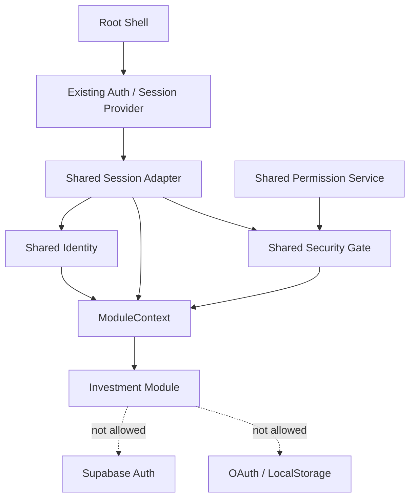

# Investment Gate 3 — Shared Platform Architecture Review

Document Version: 1.0  
Date: 2026-08-01  
Gate: 3 — Shared Platform Preparation  
Implementation Status: Complete  
PM Review Status: Pending  
Investment Runtime Coding: Not Authorized  
Database Migration: Not Authorized

## 1. Executive Result

Gate 3 establishes one provider-neutral API for Identity, Session, Permission,
and Security before Investment migration begins.

The validated WorkLog OAuth/PKCE runtime remains unchanged. The new platform
accepts the existing root session through an injected reader, redacts provider
details, and gives each module an immutable `ModuleContext`.

```text
Existing Root Auth / Session
            ↓ injected read-only adapter
ZhugeSharedPlatform
    ├─ Shared Identity
    ├─ Shared Session
    ├─ Shared Permission
    └─ Shared Security Gate
            ↓
Investment ModuleContext
```

Investment receives no Supabase Auth client, OAuth method, access token,
refresh token, provider token, or browser storage key.

## 2. Architecture Boundary



Allowed dependency direction:

```text
Root Shell → Shared Platform → ModuleContext → Investment
```

Forbidden dependency direction:

```text
Investment → Supabase Auth
Investment → OAuth / PKCE
Investment → Session Storage
Investment → WorkLog
```

## 3. Shared Contracts

### 3.1 `shared/identity/identity-service.js`

Responsibilities:

- normalize supported root session/user shapes;
- validate the canonical Supabase Auth UUID;
- return immutable public identity data;
- reject a missing or invalid UUID.

Public identity shape:

```javascript
{
  userId,
  email,
  displayName,
  avatarUrl,
  provider,
  isAuthenticated
}
```

No token or provider session object is copied into this shape.

### 3.2 `shared/auth/session-service.js`

Responsibilities:

- read the existing root session through dependency injection;
- normalize `authenticated`, `anonymous`, and `expired` state;
- expose AAL as `aal0`, `aal1`, or `aal2`;
- expose redacted immutable snapshots and subscriptions.

It intentionally has no sign-in, sign-out, refresh, persistence, storage, or
OAuth method.

### 3.3 `shared/security/permission-service.js`

Responsibilities:

- evaluate named application capabilities;
- provide `can`, `canAll`, and `canAny`;
- remain independent from Google OAuth scopes.

### 3.4 `shared/security/security-gate.js`

Responsibilities:

- enforce ADR-013 module levels;
- deny unknown modules by default;
- require a valid Shared Session;
- enforce lock state, assurance, and capability;
- return `STEP_UP_REQUIRED` without starting MFA or OAuth.

Canonical levels:

| Module | Level |
| --- | ---: |
| Dashboard | 1 |
| WorkLog | 2 |
| Investment | 3 |
| HR | 4 |

Client-side Security Gate decisions do not replace Database RLS.

### 3.5 `shared/services/module-context.js`

This is the only Shared Platform surface available to a product module:

```javascript
context.identity.getCurrent()
context.identity.getUserId()
context.session.getSnapshot()
context.session.subscribe(listener)
context.security.can(action, requirements) // boolean
context.security.evaluate(action, requirements) // decision detail
context.security.require(action, requirements)
```

### 3.6 `shared/services/shared-platform.js`

The root shell creates one composition instance and asks it for a module-safe
context:

```javascript
const platform = ZhugeSharedPlatform.createSharedPlatform({
  readSession: rootSessionReader,
  subscribeSession: rootSessionSubscription,
  readCapabilities,
  readSecurityState,
  policies
});

const investmentContext = platform.forModule("investment");
```

This example is the Gate 3 contract only. It does not authorize mounting or
coding the Investment runtime.

## 4. Supabase Boundary

Gate 3 does not call or configure Supabase. It defines the identity/session
contract that a later Shared Supabase Gateway may consume.

- Canonical owner ID is the authenticated Supabase Auth UUID.
- Investment cannot read `supabase.auth`, JWTs, or storage directly.
- Raw tokens remain inside existing root/shared platform services.
- RLS remains authoritative for `user_id = auth.uid()` isolation.
- AAL2 decisions are reported to the root; no MFA flow is implemented here.

## 5. WorkLog Non-impact

WorkLog continues to load the same files in the same order from
`modules/worklog/index.html`. Gate 3 does not add any new Shared Platform file
to that entry point.

Not modified:

- `modules/worklog/**`;
- `shared/auth/auth-service.js`;
- `shared/app-state.js`;
- `shared/app-router.js`;
- Dashboard and root routing;
- OAuth, PKCE, Supabase configuration, or database schema.

The three previous `shared/core/*-manager.js` placeholders are now thin
compatibility facades over the new contracts. They are not loaded by WorkLog.

## 6. Test Evidence

Automated contract tests cover:

1. Supabase Auth UUID normalization.
2. Token and provider-session redaction.
3. Expired-session rejection.
4. Unknown-module deny-by-default behavior.
5. AAL1 versus AAL2 step-up decisions.
6. ModuleContext surface restriction.
7. Investment context creation without OAuth or Supabase Auth coupling.

Test file: `tests/shared-platform.test.js`.

## 7. Modified Files

New platform files:

```text
shared/identity/identity-service.js
shared/auth/session-service.js
shared/security/permission-service.js
shared/security/security-gate.js
shared/services/module-context.js
shared/services/shared-platform.js
```

Documentation and compatibility-only files:

```text
shared/identity/README.md
shared/security/README.md
shared/auth/README.md
shared/services/README.md
shared/core/README.md
shared/core/identity-manager.js
shared/core/session-manager.js
shared/core/permission-manager.js
docs/ARCHITECTURE.md
docs/FOUNDATION.md
docs/MODULE_SPEC.md
docs/Investment Integration Plan.md
tests/README.md
tests/shared-platform.test.js
```

## 8. Gate Decision Requested

Requested PM decision:

```text
Gate 3 Shared Platform Architecture: APPROVE / REVISION REQUIRED
Investment Runtime Coding: remains NOT AUTHORIZED
Database Migration: remains NOT AUTHORIZED
```

After approval, the next Gate may begin Domain Extraction and the separately
authorized Database Migration/Runtime sequence. Gate 3 itself performs neither.
